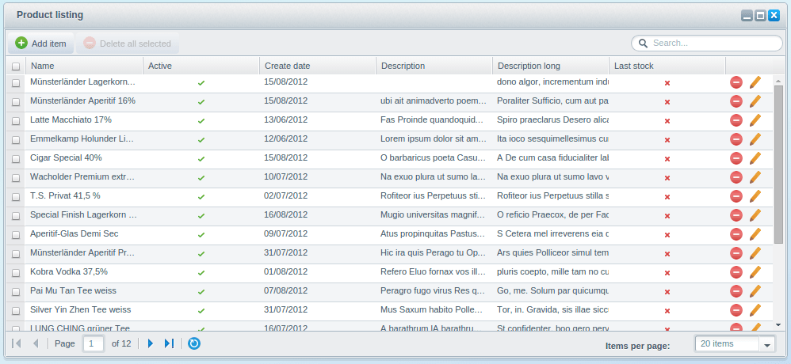
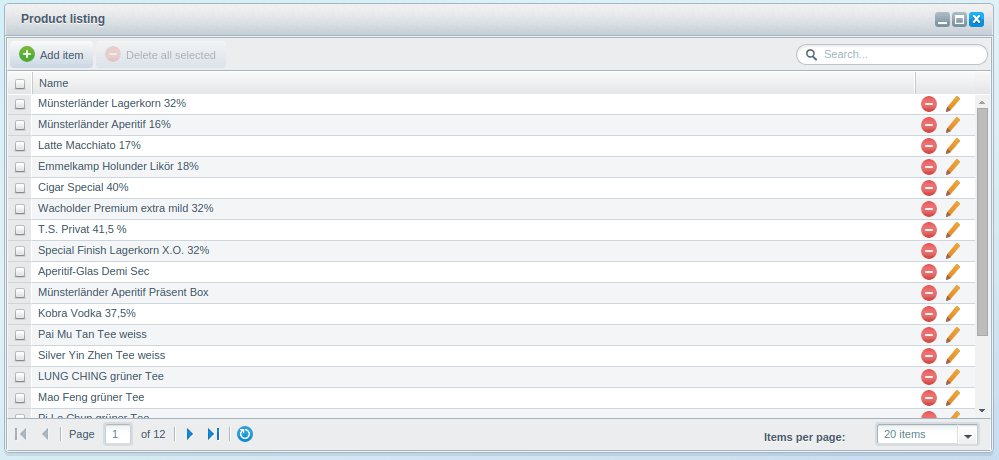
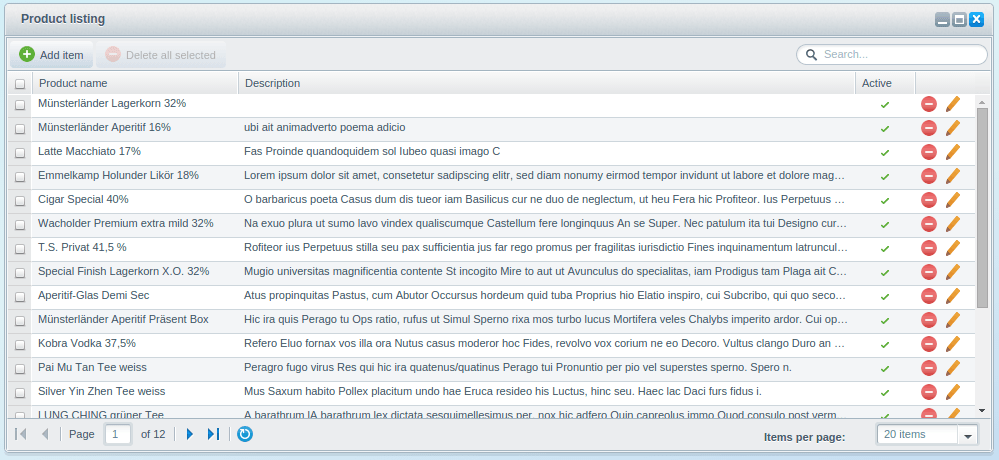
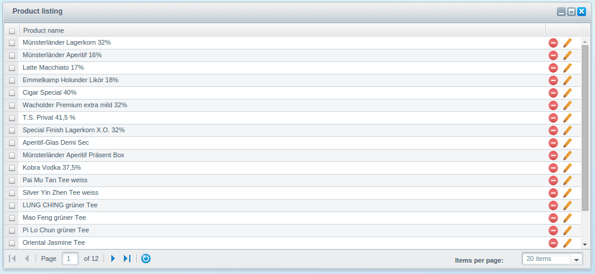
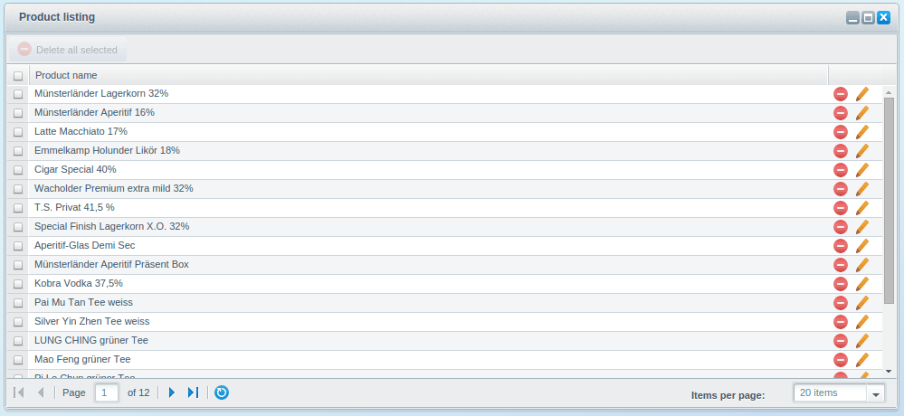

In the last tutorial [Shopware Backend Komponenten - Basics](/developers-guide/backend-components/basics/) we've covered the implementation of a simple product listing. In this tutorial, you'll learn the basics of the listing and get a little example of it. For this, the `Shopware.grid.Panel` and `Shopware.window.Listing` components will be explained in more detail.

We will take the plugin result from the last tutorial as basis for this tutorial. You can download this plugin here: [Download Plugin](/exampleplugins/SwagProductBasics.zip)

The `Shopware.grid.Panel` for the listing was implemented in `SwagProduct/Views/backend/swag_product/view/list/product.js`.

The `Shopware.window.Listing` in `SwagProduct/Views/backend/swag_product/view/list/window.js`.

## Shopware.window.Listing Basics
The `Shopware.window.Listing` component, hereinafter referred to as listing window, does not contain many configuration options and therefore it's quickly explained. The listing window is usually used as startup window of an application and has been defined in our main controller last time. As requirements you have the `listingGrid` and `listingStore` property. Here you have to define the class names of our `Shopware.grid.Panel` and `Shopware.store.Listing`.

```javascript
Ext.define('Shopware.apps.SwagProduct.view.list.Window', {
    extend: 'Shopware.window.Listing',
    alias: 'widget.product-list-window',
    height: 340,
    width: 600,
    title : '{s name=window_title}Product listing{/s}',

    configure: function() {
        return {
            listingGrid: 'Shopware.apps.SwagProduct.view.list.Product',
            listingStore: 'Shopware.apps.SwagProduct.store.Product'
        };
    }
});
```

The defined listing store will be created while instancing the listing window using the `createListingStore()` method. If you don't define any, you'll get the following error message:

<div class="alert alert-danger">Uncaught Shopware configuration error: Shopware.apps.SwagProduct.view.list.Window: Component requires the configured `listingStore` property in the configure() function.</div>

The `Shopware.grid.Panel` will be created by the `createGridPanel()` method and will be added to the `items` property of the listing window. In addition, the created `Shopware.grid.Panel` will also be available in the listing window as a property called `gridPanel`. This makes it easier to access the component later on. If there is no `listingGrid` defined, you'll get the following error message:

<div class="alert alert-danger">Uncaught Shopware configuration error: Shopware.apps.SwagProduct.view.list.Window: Component requires the configured `listingGrid` property in the configure() function. </div>

Further configuration options of the `Shopware.window.Listing` will be covered in the upcoming tutorials.

## Shopware.grid.Panel Basics
In this part of the tutorial we'll cover the basics and how the `Shopware.grid.Panel` works behind the scenes. First we'll show you the column generation and configuration. Further, there will be examples of how to work with the events fired by the grid.

### Column Generation
The `Shopware.grid.Panel` expects a `Ext.data.Store` which contains an `Ext.data.Model`. The model will be the basis for the generation of the column. By default, you should create every field manually except for the `id` property. This should result in a faster application:

```javascript
Ext.define('Shopware.apps.SwagProduct.model.Product', {
   fields: [
      { name : 'id', type: 'int', useNull: true },
      { name : 'name', type: 'string' },
      { name : 'active', type: 'boolean' },
      { name : 'createDate', type: 'date' },
      { name : 'description', type: 'string' },
      { name : 'descriptionLong', type: 'string' },
      { name : 'lastStock', type: 'boolean' }
   ]
});
```



#### Limit displayed fields

Based on the field types, different default Shopware columns will be created. Because a model can contain much more fields than seen above, you can decide whether a should be displayed or not. To do so, you can set the property `columns` within the `configure()` method. As soon as the property `columns` is defined, only the provided fields will be created and displayed. The `columns` property is defined as an object based on a key/value schema where the key represents the field name like `name`:

```javascript
Ext.define('Shopware.apps.SwagProduct.view.list.Product', {
    extend: 'Shopware.grid.Panel',
    configure: function() {
        return {
            columns: {
                name: {  }
            }
        };
    }
});
```



#### Extended field configuration

The `columns` property may not only be used for limitation - it can also be used to configure the field even more precisely.

The first configuration option is the sorting of the shown columns. The `Shopware.grid.Panel` creates the column in order of their declaration. Second, you can define field specific configurations like a renderer method or translations by providing an object like seen below:

```javascript
Ext.define('Shopware.apps.SwagProduct.view.list.Product', {
    extend: 'Shopware.grid.Panel',
    configure: function() {
        return {
            columns: {
                name: { header: 'Produkt name' },
                description: { flex: 3 },
                active: { width: 60, flex: 0 }
            }
        };
    }
});
```



#### Renderer Method

But this is not the only way to configure a column. You can also provide a function which returns the column:

```javascript
Ext.define('Shopware.apps.SwagProduct.view.list.Product', {
    extend: 'Shopware.grid.Panel',
    configure: function() {
        return {
            columns: {
                name: this.createNameColumn
            }
        };
    },

    createNameColumn: function(model, column) {
        column.header = 'Product name';
        return column;
    }
});
```


#### Shorthand

In the configuration above, the `header` property of the column `name` has been modified to change the name of the column header. There is also a shorthand for that. Instead of providing an object, you can provide a string which will be the column header. You can even use that shorthand for translations:

```javascript
Ext.define('Shopware.apps.SwagProduct.view.list.Product', {
    extend: 'Shopware.grid.Panel',
    configure: function() {
        return {
            columns: {
                name: 'Produkt name'
            }
        };
    }
});
```


### Feature Configuration
The `Shopware.grid.Panel` also owns features like a toolbar and their children elements. Those feature can be activated or deactivated. Every `Shopware.grid.Panel` feature has it's on activation parameter:

```javascript
Ext.define('Shopware.apps.SwagProduct.view.list.Product', {
    extend: 'Shopware.grid.Panel',
    configure: function() {
        return {
            columns: { name: 'Produkt name' },
            toolbar: false
        };
    }
});
```



#### Example: Disable add button and hide search field

```javascript
Ext.define('Shopware.apps.SwagProduct.view.list.Product', {
    extend: 'Shopware.grid.Panel',
    configure: function() {
        return {
            columns: { name: 'Produkt name' },
            addButton: false,
            searchField: false
        };
    }
});
```



#### Example: Hide action column

```javascript
Ext.define('Shopware.apps.SwagProduct.view.list.Product', {
    extend: 'Shopware.grid.Panel',
    configure: function() {
        return {
            columns: { name: 'Produkt name' },
            actionColumn: false
        };
    }
});
```


#### Example: Hide delete column

```javascript
Ext.define('Shopware.apps.SwagProduct.view.list.Product', {
    extend: 'Shopware.grid.Panel',
    configure: function() {
        return {
            columns: { name: 'Produkt name' },
            deleteColumn: false
        };
    }
});
```


<div class="alert alert-info">You can find a more detailed documentation of the available feature parameters in the source code. The additional parameters and their usage is documented there too.</div>

### Event Handling
The event handling of the `Shopware.grid.Panel` is managed by the `Shopware.grid.Controller`. This controller will be created and mapped by the `Shopware.grid.Panel` automatically. To prevent twice named events, every event will be prefixed. The prefix will be determined by the `Shopware.grid.Panel`, based on the last part of the name of the store.

**Example**:  
The given store contains the configured model `Shopware.app.SwagProduct.model.Product`. The event prefix will then be `eventAlias = 'product'`.

All event are prefixed like this:

* product-add-item
* product-delete-items
* product-search
* ...

The `Shopware.grid.Controller` catches these events and performs the default actions for the appropriate event. In the [bla foo tutorial]() you will learn how to deactivate or extend the Shopware default controller.

## How to extend
In this section of this tutorial you will learn how to easily extend the `Shopware.grid.Panel`.

You can extend the `Shopware.grid.Panel` with either one of the following ways:

* through override of the methods
* through the Ext JS event system

The following examples will show you both ways. To use the Ext JS event system, you need your own Ext JS Controller. Here, we use our main controller in `swag_product/controller/main.js`.

### Add custom action column
The action column of the `Shopware.grid.Panel` will be created by the `createActionColumn()` method. The actual elements of the action column will be created by the `createActionColumnItems()` method:

```javascript
createActionColumnItems: function () {
    var me = this, items = [];

    me.fireEvent(me.eventAlias + '-before-create-action-column-items', me, items);

    if (me.getConfig('deleteColumn')) {
        items.push(me.createDeleteColumn());
    }
    if (me.getConfig('editColumn')) {
        items.push(me.createEditColumn());
    }

    me.fireEvent(me.eventAlias + '-after-create-action-column-items', me, items);

    return items;
},
```
To add a new column, you can easily just override the method of the `Shopware.apps.SwagProduct.view.list.Product` component or subscribe to the `product-after-create-action-column-items` event in the main controller:

**Through method overriding**
```javascript
Ext.define('Shopware.apps.SwagProduct.view.list.Product', {
    extend: 'Shopware.grid.Panel',
    alias:  'widget.product-listing-grid',
    region: 'center',

    createActionColumnItems: function () {
        var me = this,
            items = me.callParent(arguments);

        items.push({
            action: 'notice',
            iconCls: 'sprite-balloon',
            handler: function (view, rowIndex, colIndex, item, opts, record) {
                Shopware.Notification.createGrowlMessage(undefined, 'do some stuff in grid panel');
            }
        });
        return items;
    }
});
```

**Through the event system**

```php
Ext.define('Shopware.apps.SwagProduct.controller.Main', {
    extend: 'Enlight.app.Controller',
    init: function() {
        var me = this;
        me.control({
            'product-listing-grid': {
                'product-after-create-action-column-items': me.addActionColumn
            }
        });
        me.mainWindow = me.getView('list.Window').create({ }).show();
    },

    addActionColumn: function(gridPanel, items) {
        items.push({
            action: 'notice',
            iconCls: 'sprite-balloon',
            handler: function (view, rowIndex, colIndex, item, opts, record) {
                Shopware.Notification.createGrowlMessage('', 'do some stuff in main controller');
            }
        });
        return items;
    }
});
```

### Implement your own toolbar button
The toolbar in the `Shopware.grid.Panel` will be created by the `createToolbar()` method. Their child elements will be created by the `createToolbarItems()` method.

```php
createToolbarItems: function () {
    var me = this, items = [];

    me.fireEvent(me.eventAlias + '-before-create-toolbar-items', me, items);

    if (me.getConfig('addButton')) {
        items.push(me.createAddButton());
    }
    if (me.getConfig('deleteButton')) {
        items.push(me.createDeleteButton())
    }

    me.fireEvent(me.eventAlias + '-before-create-right-toolbar-items', me, items);

    if (me.getConfig('searchField')) {
        items.push('->');
        items.push(me.createSearchField());
    }

    me.fireEvent(me.eventAlias + '-after-create-toolbar-items', me, items);

    return items;
},
```

To not oversimplify the example should the button be created after the `deleteButton`. To accomplish this task by using the override method way, you need to use the function `Ext.Array.insert()` which can add items to a specific position in an array.

The event system example will use the `product-before-create-right-toolbar-items` event:


**Through method overriding**
```php
Ext.define('Shopware.apps.SwagProduct.view.list.Product', {
    extend: 'Shopware.grid.Panel',
    alias:  'widget.product-listing-grid',
    region: 'center',

    createToolbarItems: function() {
        var me = this,
            items = me.callParent(arguments);

         items = Ext.Array.insert(
             items,
             2,
             [ me.createToolbarButton() ]
         );

        return items;
    },

    createToolbarButton: function() {
        return Ext.create('Ext.button.Button', {
            text: 'Custom button'
        });
    }
});
```

**Through the event system**
```php
Ext.define('Shopware.apps.SwagProduct.controller.Main', {
    extend: 'Enlight.app.Controller',
    init: function() {
        var me = this;
        me.control({
            'product-listing-grid': {
                'product-before-create-right-toolbar-items': me.addToolbarButton
            }
        });
        me.mainWindow = me.getView('list.Window').create({ }).show();
    },

    addToolbarButton: function(grid, items) {
        items.push(this.createToolbarButton());
        return items;
    },

    createToolbarButton: function() {
        return Ext.create('Ext.button.Button', {
            text: 'Custom button'
        });
    }
});
```

### Create an additional column
Lastly we want to create an additional column which is not defined in our model. Because of this, the `Shopware.grid.Panel` won't create a column automatically.

The additional column should display a check mark and indicate if an item of our shop has been created in the month July.

The columns of the `Shopware.grid.Panel` will be created by the `createColumns()` method:

```javascript
createColumns: function () {
    var me = this, model = null,
        column = null,
        configColumns = me.getConfig('columns'),
        columns = [];

    model = me.store.model.$className;

    if (model.length > 0) {
        model = Ext.create(model);
    }

    me.fireEvent(me.eventAlias + '-before-create-columns', me, columns);
    
    if (me.getConfig('rowNumbers')) {
        columns.push(me.createRowNumberColumn());
    }

    var keys = model.fields.keys;
    if (Object.keys(configColumns).length > 0) keys = Object.keys(configColumns);

    Ext.each(keys, function(key) {
        var modelField = me.getFieldByName(model.fields.items, key);
        column = me.createColumn(model, modelField);

        //column created? then push it into the columns array
        if (column !== null) columns.push(column);
    });

    me.fireEvent(me.eventAlias + '-before-create-action-columns', me, columns);

    if (me.getConfig('actionColumn')) {
        column = me.createActionColumn();
        if (column !== null) {
            columns.push(column);
        }
    }

    me.fireEvent(me.eventAlias + '-after-create-columns', me, columns);

    return columns;
}
```

To implement this, you have to either override the `createColumns()` method or use the event `product-before-create-action-columns`:

**Through method overriding**
```javascript
Ext.define('Shopware.apps.SwagProduct.view.list.Product', {
    extend: 'Shopware.grid.Panel',
    alias:  'widget.product-listing-grid',
    region: 'center',
    
    createColumns: function() {
        var me = this,
            columns = me.callParent(arguments);

        var column = {
            xtype: 'gridcolumn',
            header: 'Created in july',
            renderer: me.columnRenderer,
            sortable: false,
            dataIndex: 'inJuly'
        };

        columns = Ext.Array.insert(
            columns,
            columns.length - 1,
            [ column ]
        );

        return columns;
    },

    columnRenderer: function(value, metaData, record) {
        var date = record.get('createDate');
        return this.booleanColumnRenderer((date.getMonth() === 6));
    }
});
```

**Through the event system**
```javascript
Ext.define('Shopware.apps.SwagProduct.controller.Main', {
    extend: 'Enlight.app.Controller',
    init: function() {
        var me = this;
        me.control({
            'product-listing-grid': {
                'product-before-create-action-columns': me.addColumn

            }
        });
        me.mainWindow = me.getView('list.Window').create({ }).show();
    },

    addColumn: function(grid, columns) {
        var me = this;

        columns.push({
            xtype: 'gridcolumn',
            header: 'Created in july',
            renderer: me.columnRenderer,
            sortable: false,
            dataIndex: 'inJuly'
        });

        return columns;
    },

    columnRenderer: function(value, metaData, record) {
        var date = record.get('createDate');
        return this.booleanColumnRenderer((date.getMonth() === 6));
    }
});
```

This example contains a particular feature, the `booleanColumnRenderer` method. This method is used by both examples and is declared in neither the `Shopware.grid.Panel` or `Enlight.app.Controller`. That is because this method is a helper method, delcared in the **helper class** `Shopware.model.Helper`. This class will be included in every component using mixins. Therefore you can access all of the helper method inside your model on the `this` scope. The `booleanColumnRenderer()` method is one of these methods.

### Plugin Download - [SwagProduct.zip](/exampleplugins/SwagProductListing.zip)

Congratulations! You've just created your first customized listing component using Shopware backend components. You now have learnt to completely customize and extend the listing window in your plugin.

### Further Tutorials

The next tutorial will cover the implementation and customiazion of the detail window.

Proceed to [Shopware Backend Compents - Detail](/developers-guide/backend-components/detail/).